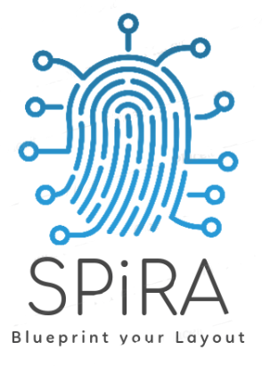

<br />

<p align="center">
  <a href="https://github.com/rubenvanstaden/spira">
    
  </a>

  <h3 align="center">Quantum Layout Design Environment</h3>

  <p align="center">
    The next-generation object-oriented script-based PCell design environment.
    <br />
    <a href="https://spira.readthedocs.io/en/latest/"><strong>Explore the docs »</strong></a>
    <br />
  </p>

</p>

## About The Project


**SPiRA** is the next-generation object-oriented script-based PCell design environment.
The framework leverages the Python programming language to effectively generate circuit layouts,
while simultaneously checking for design violations, through a novel methodology called *validate-by-design*. 
Creating PCells and extracting a model from a layout requires data from the fabrication process. 
A new PDK scheme is introduced, called the Rule Deck Database (RDD), that effectively connects
process data to the SPiRA framework. The design of the **RDD** revolves around the principle that
a PDK cannot be created, but rather that it evolves as our understanding of physical layout design evolves.

## Getting Started

This is an example of how you may give instructions on setting up your project locally.
To get a local copy up and running follow these simple example steps.

### Prerequisites

Clone or download the SPiRA source code into a directory of your choice.

This is an example of how to list things you need to use the software and how to install them in CentOS 7:

1. We need to install the latest C++ compiler and some libraries.

   ```bash
   sudo yum install epel-release
   sudo yum update
   sudo yum install centos-release-scl
   sudo yum install devtoolset-9
   sudo yum install \
   	libffi-devel \
       openssl-devel \
       readline-devel \
       sqlite-devel \
       libGL-devel \
       libGLU-devel \
       fltk-devel \
       zlib-devel \
       bzip2-devel \
       ncurses-devel \
       tk-devel \
       gdbm-devel \
       db4-devel \
       libpcap-devel \
       xz-devel \
       sqlite
   ```

   

2. We need at least Python 3.8 or above, but CentOS 7 repositories only provide 3.6:

   ```bash
   curl https://pyenv.run | bash
   ```

   Now edit the `~/.bashrc` file and add the following lines at the bottom:

   ```bash
   export PYENV_ROOT="$HOME/.pyenv"
   export PATH="$PYENV_ROOT/bin:$PATH"
   eval "$(pyenv init --path)"
   eval "$(pyenv virtualenv-init -)"
   ```

   Now execute:

   ```bash
   exec $SHELL -l
   pyenv install 3.8.7
   pyenv global 3.8.7
   ```

3. We need a working copy of `gmsh` but the one provided by Python Pip requires a newer C ABI (application binary interface) than the one provided by CentOS 7. So let's do some magic. First download the `gmsh` source code using `git`:

   ```bash
   mkdir Development
   cd Development
   git clone https://gitlab.onelab.info/gmsh/gmsh.git
   cd gmsh
   scl enable devtoolset-9 bash
   pip install cmake
   mkdir build
   cd build
   cmake -DENABLE_BUILD_DYNAMIC=1 ..
   make
   sudo make install
   sudo touch /etc/ld.so.conf.d/gmsh_x86_64.conf
   sudo bash -c 'echo "/usr/local/lib64">>/etc/ld.so.conf.d/gmsh_x86_64.conf'
   sudo ldconfig
   ```

   This will enable the `gmsh` command to open up GMSH.

### Installation

To install SPiRA, please follow these steps:

1. In the directory where this `README.md` file is found execute the following:

   ```bash
   pip install -r requirements.txt
   ```

   This will install the Python Pip version of `gmsh` needed for the `import gmsh` command, but will not work because of of the wrong `CXX_ABI`. 

2. To fix this run `python` and type in the following:

   ```python
   import gmsh
   ```

   This will give the warning about the wrong ABI and give the location of the `libgmsh.so` file that does not comply.

3. Simply replace the infringing file with the one built earlier from source:

   ```bash
   cp ~/Development/gmsh/build/libgmsh.so ~/.loacl/lib/libgmsh.so
   ```

   Replacing the second path the real path to the `libgmsh.so` complained about before.

4. Now carry on with the install of SPiRA

   ```bash
   pip install .
   ```

   This will install the necessary remaining requirements and SPiRA itself.

5. Now execute `python` and type the following:

   ```python
   import spira
   import gmsh
   ```

   If all went well you should be greeted with the SPiRA welcoming banner and no issues.

## Usage

_For examples, please refer to the [Documentation](https://spira.readthedocs.io/en/latest/)_

All examples can be ran from the environment directory, which is the home directory of your ``spira`` folder.
For the basic tutorial samples:

```python
python tutorials/basic/_9_stretch_1.py
```

For the more advanced example with their own defined Rule Deck Database, as
explained [here](https://spira.readthedocs.io/en/latest/).

```python
python spira/technologies/default/circuits/ytron_circuit.py
```

## License

Distributed under the MIT License. See `LICENSE` for more information.

<!-- CONTACT -->
## Contact

* Johannes Delport - [jdelport@sun.ac.za]()
* Kyle Jackman - [kjackman@sun.ac.za]()
* Coenrad Fourie - [coenrad@sun.ac.za]()

## Acknowledgements

* [Gdspy](https://github.com/heitzmann/gdspy)
* [Phidl](https://github.com/amccaugh/phidl)
* [Clippers](http://www.angusj.com/delphi/clipper.php)

## History of changes

### Version 0.2.2 (June 11, 2021)

- Implementation of the RoutePath function to route inductors between two ports along a specified path
- Code cleanup

### Version 0.2.0 (October 4, 2019)

* Added layout netlist extraction and viewing.
* Added electrical rule checking (ERC).
* Added **filters** for advanced layout manipulation.
* Updated ports for more information descriptions. Terminals can now be separated from port definitions.
* A new concept, called **virtual modeling** (VModel) is introduced. This allows you to create multiple, virtual versions of a single layout for either debugging or fabrication purposes.
* Routing algorithms have been updated to leverage speed improvements made in the Gdspy library.
* The GDSII parser has been updated for better code structure and faster read/write operations.

### Version 0.1.1 (July 16, 2019)
* Updated the advanced tutorial documentation.
* Added developers documentations.
* Updated the expand transform algorithms, which fixes a lot of known issues.
* Updated the GDSII input parser to use new transformation parameters.
* Changed the ``ref`` parameter to ``reference`` in ``SRef``.

### Version 0.1.0 (July 10, 2019)
* Added first version of documentation.
* Renamed ``Fields`` to ``Parameters`` to overcome confusion.
* Renamed ``elemental`` to ``elements``, since ``spira.Cell`` does not inherit from ``gdspy.Cell`` anymore.
* Added parameter restrictions and preprocessing capabilities.
* Updated parameters to accept an extra restriction argument.
* Introduces ``Vector``, ``Line``, and ``Coord`` classes.
* Depricated locked ports. Instead different port purposes can now be defined.
* Introduces *process* and *purpose* parameters to layer elements.
* Introduces *derived layers* to allow for layer boolean operations. This makes the RDD more flexible for future technology changes.
* Updated the edge generation algorithms to include both an outside and inside edge.
* Updated the routing algorithms to use new ``gdspy`` features.
* Added stretching operations.
* Extended the RDD to include *display resources*.
* Fix issues with writing to a GDSII file.
* Added snap to grid functionality.
* Implemented parameters caching.
* Added port alignment operations.
* Added `PortList` class for special port filtering functionality.
* Created layer mappers.
* Changed the default coordinate system to improve port transformations.
* Updates shapes and polygons to only include single polygons. Multiple polygons are now moved to the ``PolygonGroup`` class.
* Updated ports to extend from the ``Vector``.
* Added a custom ``LayerList`` class that compares already added layers.
* Updated mixins to a single ``MixinBowl`` meta-configuration.
* Updated the datatype parameter of ports that represents primitive connects.
* Added ``NumberParameter`` which supports 'int' and 'float' parameters.
* Added ``ComplexParameter`` which supports 'int', 'float' and 'complex' parameters.
* Added automatic docstring generation.

### Version 0.0.3 (March 12, 2019)
* Added Dummy ports for crossing nodes in netlist.
* Automatically generate terminal edges for metal polygons.
* Added shape for yTron.
* Added path routing between two terminals.
* Define a route using a list of terminals.
* Device cell detection (Junction, Via, etc).
* Basic LVS implementation.

### Version 0.0.2 (Jan 11, 2019)
* Implemented Manhattan routing between terminals.
* Integrated circleci.
* Started adding unit tests using pytest.
* Updated auto doc generation for classes.
* Added MidPointField for port and terminal midpoints.
* Introduces the Shape class that allows for complex point manipulations.
* Introduces `term` which is a vertical connection port.
* Routes are defined as a Shape with two connected terminal ports.

### Version 0.0.1 (Dec 01, 2018)
* Initial release.
